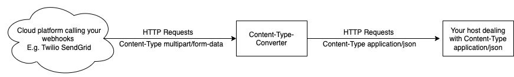

# Content-Type Converter

This simple web app proxies incoming requests to another host. While in transit, the app converts the `Content-Type: multipart/form-data` to `Content-Type: application/json`.



## Configuration

You can adjust the target host via the environment variable `FORWARD_TO`.

## Getting Started

The simplest way to use this app is to clone and run it locally:

```Bash
git clone https://github.com/IObert/content-type-converter
cd content-type-converter
npm install
npm build
FORWARD_TO=https://twil.io node dist/server.js
```

If you already use [Docker](https://docs.docker.com/get-started/overview/), you can run the [image](https://github.com/IObert/content-type-converter/pkgs/container/content-type-converter) locally.

```Bash
docker pull ghcr.io/iobert/content-type-converter:main
docker run -it -p 8080:8080 -e FORWARD_TO="https://twil.io" ghcr.io/iobert/content-type-converter:main
```

If you want to run this image in a Kubernetes-based environment like [Kyma](https://kyma-project.io/), use this Kubernetes manifest.
> Don't forget to change the `FORWARD_TO` environment variable and the `host` of the API rule that exposes the service for inbound external traffic. 

```Bash
vi deployment.yaml 
kubectl apply --namespace basic --filename deployment.yaml 
```


